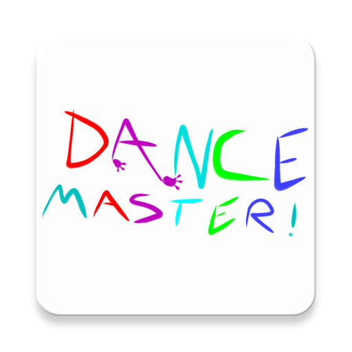

# Dance Master! 
### The Fun, Exciting App That Teaches You How to Dance!

## A Bit About The Project
Have you ever wanted to learn how to dance to the latest pop music but didn't know where to start? Well, let Dance Masters Kristy and Nick guide you through the moves in a three-step video series for each of your favorite songs! The App integrates Google's Youtube API to access videos of dance masters Kristy and Nick hosted on Youtube. The App also has access to a backend deployed on the google cloud to allow you to share your dancing experiences with friends from all over the world! This the Dance master App, you can:

* **Learn new moves in a series of easy to follow videos**
* **Earn points for each video you watch and track your daily progress** 
* **Share scores, compete with, and add friends for a full experience**

## Build Instructions
This project is meant to be build with Andriod Studio's gradle script tool. Andriod Studio is Google's IDE for Android, and you can install it [here](https://developer.android.com/studio/install.html).

## Disclaimer
I don't know own nor am not able to access the youtube account that hosts dance videos or the google account that hosts the backend. As such, I make no gaurantees about the condition of these services as they relate to the App.