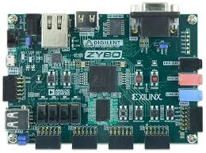
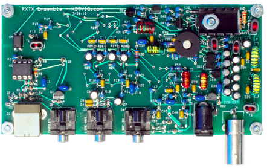
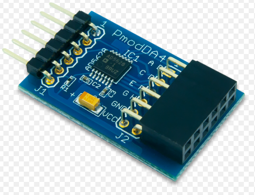
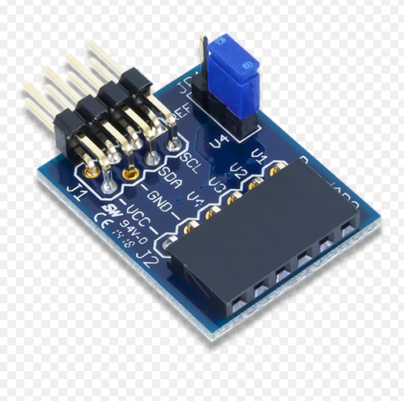
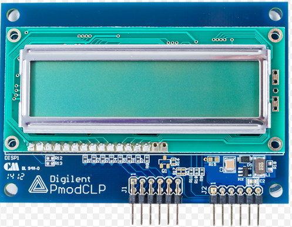
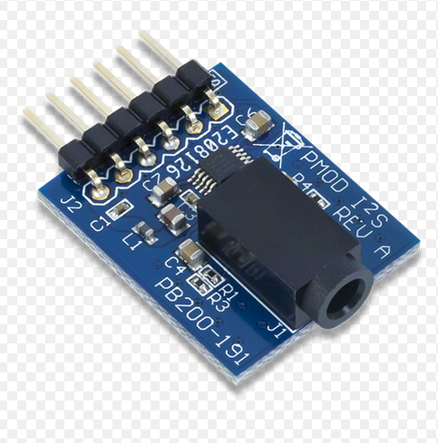

# ENGS 128 Digital Radio Project

## A Bit About The Project

This project makes use of a Xilinx board called the Zybo in order to implement a digital radio that allows one to listen to AM frequencies. Other parts include and LCD display (to visually adjust the frequency range), an A to D converter, a D to A converter, and a Softrock (transceiver board). The basic hardware design is completely implemented on the Zybo. First, I and Q signals (the real and imaginary parts of the received signal) are fed in from the Softrock board into an ADC connected to the Zybo. The Zybo then mixes the I and Q signals with two other real and imaginary signals generated by the current frequency set in the processor (this takes places in a multiplcation of signals block). After being mixed, the output signals are then fed into a FIR and CIC filters to bring the signal down to the appropriate passband and filter the signal to the desired frequency as accurately as possible. The output of the filter stage is sent out a DAC, to pmod audio codec can be hooked up. Then, all one need do is plug in their headphones to the codec and listen to the radio, using push buttons on the zybo board to adjust the frequency.

## Summary of Basic Parts

### Zybo

### Softrock

### DAC

### ADC

### LCD 

### Audio Codec

## Synopsis of Important Files
In the `/Digital_Radio_Main` directory, you should find `main.c`, which is the main source code designed to run on the set of dual core processors on the the Zybo. Note that the Zybo is an SOC (System On Chip) system, which has two processor cores for running applications (such as main.c) and FPGA fabric, which can by synthesized into functioning hardware that the processor can talk to via an AXI stream protocol. You will also find other C files at the top of this directory, such as `ClpLib.c` and `stlprintf.c`. These are convience libraries that contain functions and types present in standard ISO C (which are nonexistent in the version of C that runs native on these processors). You should also see a `lab6.srcs` directory. This contains the top-level VHDL files that organizes the entire design. In order to see the designs of each individual component in VHDL, you should look in the `/Digital_Radio_Project/Digital_Radio_IP_Repo` directory. This directory contains project folders for each component used in the design, and corresponding .vhd files with the VHDL source code for each components (in the corresponding `/srcs` directory).

## Build Instructions
In order to properly synthesize the hardware for this project as well as build the software, you will need a Xilinx license for Vivado. Other than that, the standard procedure of importing and existing .xpr file to Vivado and adding in an IP catalog is all that is needed.